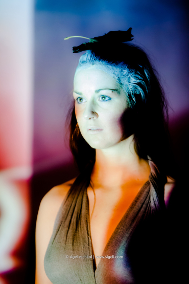
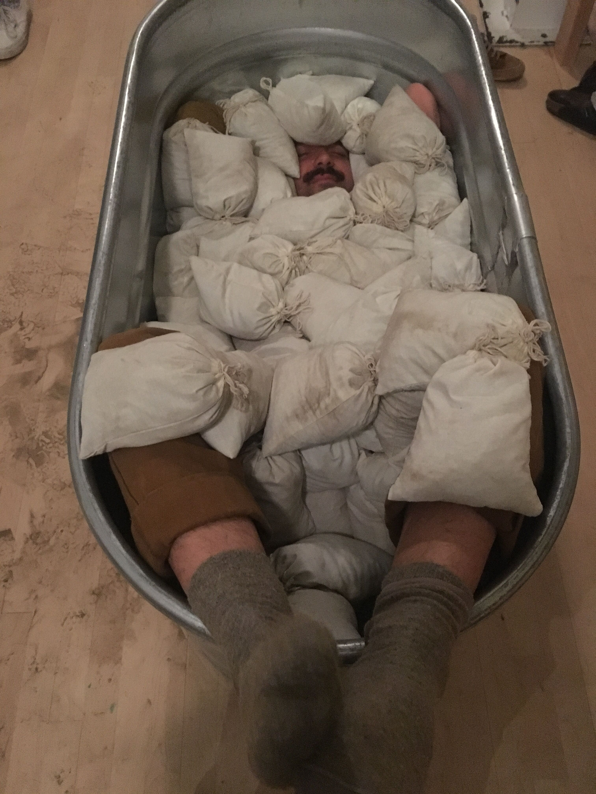
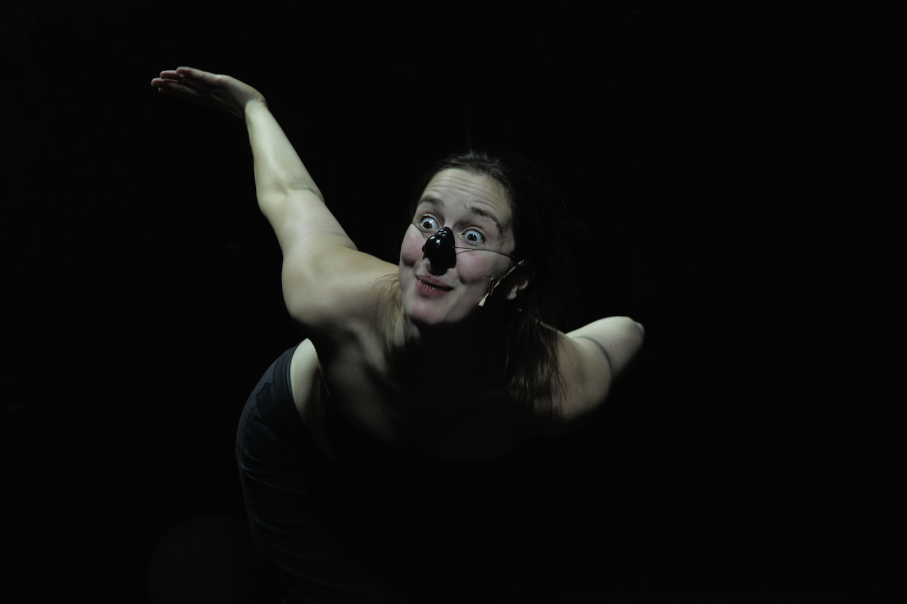
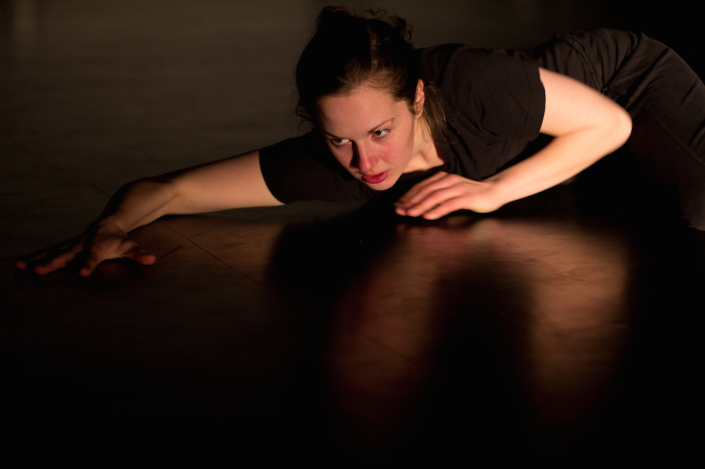
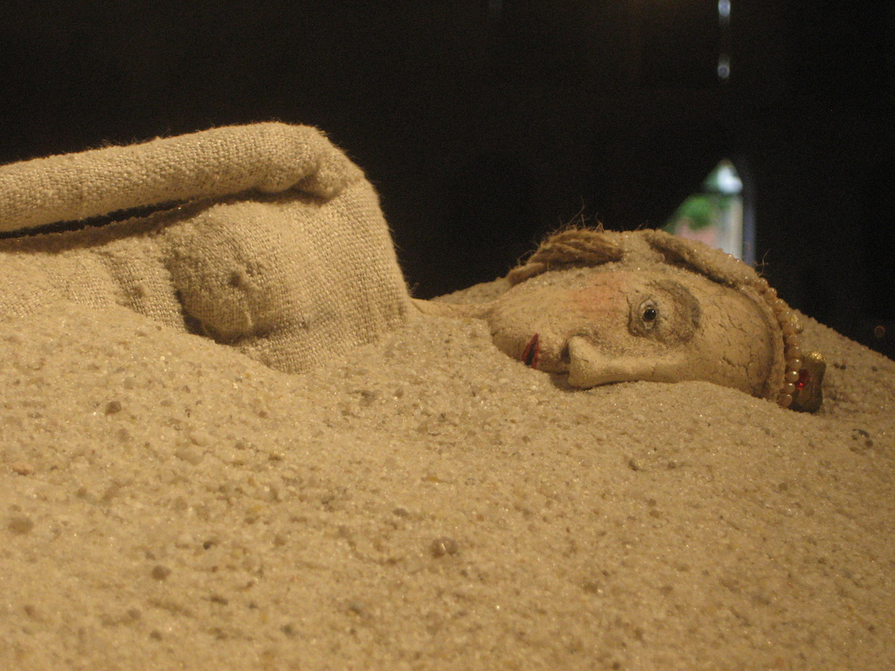
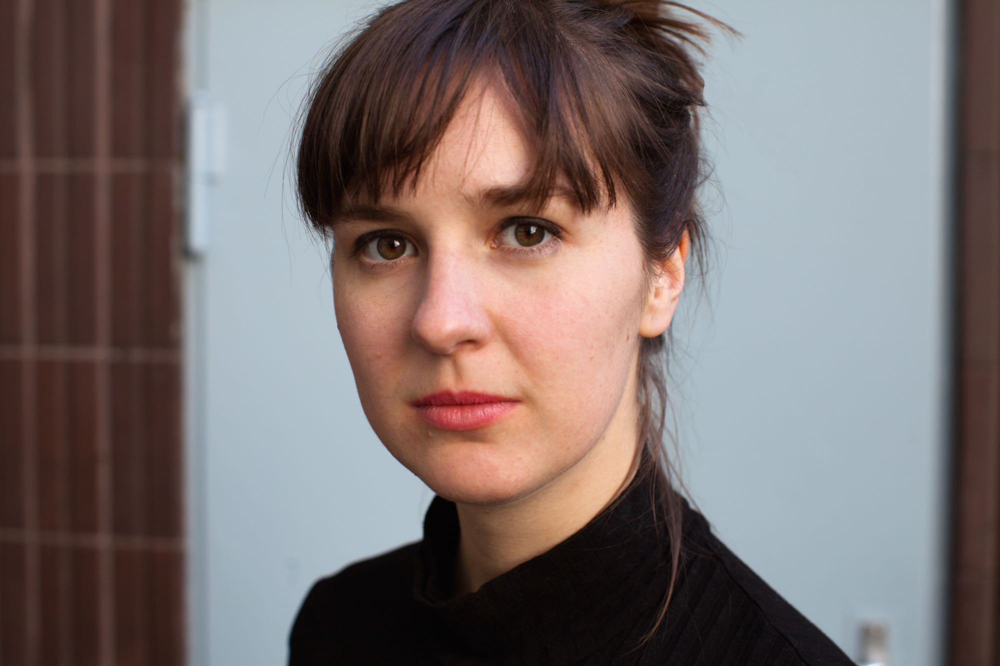

---
view: none
title: Esther Vorwerk
subtitle: Performance, Figurentheater, Installationen---

Esther Vorwerk [sie/ihr] arbeitet als interdisziplinäre Theatermacherin, schreibt literarische und szenische Texte, kreiert interaktive Installationen, Performances und Workshops und ist beratend tätig. Sie setzt sich kritisch mit Fragen zu Gender, Erinnerung, Trauma, intersektionaler Diskrimierung, intimate health und Körpergedächtnis auseinander. Ein großes Anliegen ist es ihr, Voraussetzungen für ein neues, respektvolleres Miteinander und eine offenere, enttabuisierte Kommunikation im Zusammenhang mit Diskriminierung und Krankheit zu gestalten.

Kooperationen: ALASKA Studio of feelings (Anne-Sophie Reichert) <http://alaska-studio.com/>, Gewaltfreie Television (Markus Wulf), Limonadenfabrik/Theater Laboratorium 

Download **[Esthers CV](files/cv_esther.pdf)**.

<ul class="bxslider">
	
	 <li></li>
	 
	  <li></li>
	  
    <li></li>
 
    <li></li>
    
    <li></li>
    
    <li></li>
    
    <li></li>
    
    <li></li>
    
    <li></li>
</ul>

