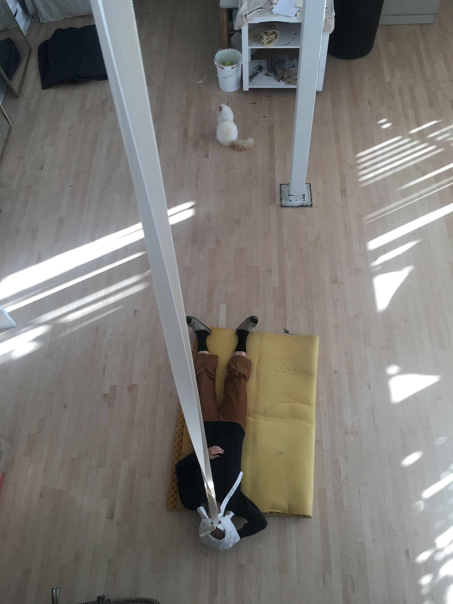

We are Esther Vorwerk and Anne-Sophie Reichert and together we are Alaska - Studio for Feelings. We met 15 years ago in high school and have been close friends since then. With Alaska - Studio for Feelings we began a collaborative arts practice in summer 2017 in Berlin. 

<ul class="bxslider">
     <li></li>
     <li></li>
          <li></li>
      <li></li>
           <li></li>
           <li></li>
     
</ul>

As Alaska, we investigate feelings, we stage atmospheres, and we curate sensibilities. We are especially interested in the function of bodily and sensual dimensions of affects and emotions in society. For us, aesthetic, sensual experiences are forms of understanding. Feelings are trained, habituated, and valorized, incorporated into our bodies and thus enacting the normative regimes of our societies. Therefore, we ask: How and to what end are we moved and touched? How do we have a say in what we feel? We are committed to experiment with feelings as tangible, bodily phenomena. Feelings are not bound to experience-collecting body propers. Rather, they are sensed in shared affective worlds. For us, feelings are interactive, taking connectivity rather than individuality as their starting points. Our work takes the shape of situations, performances and interactive installations. We provide spacetime to feel.

<http://alaska-studio.com/>