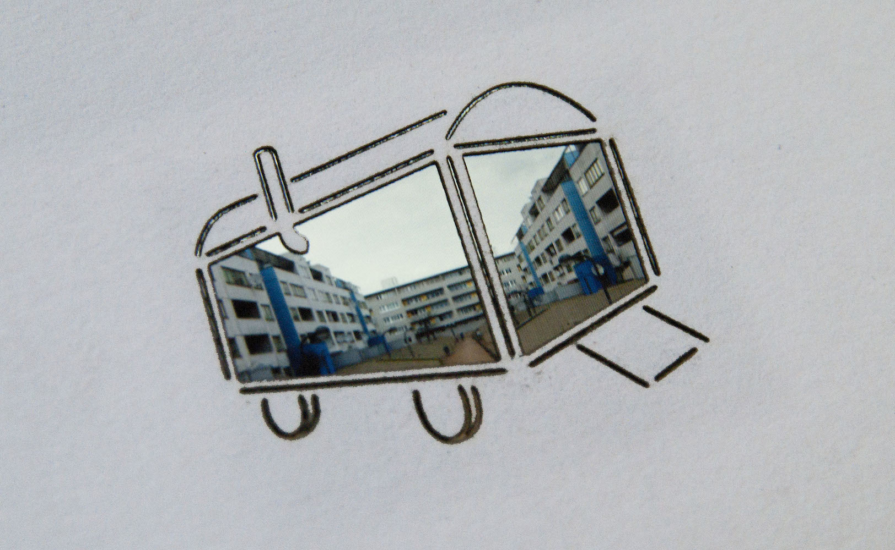
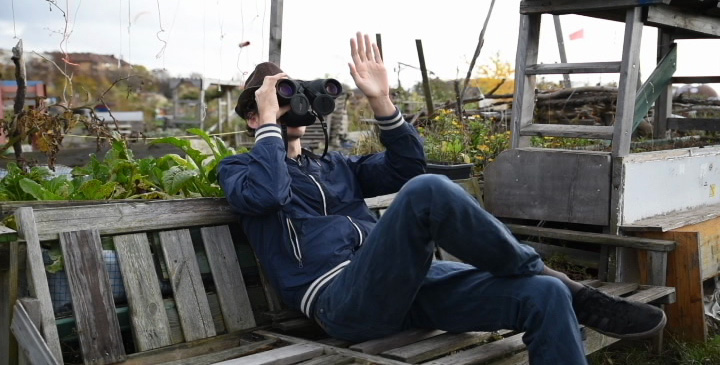
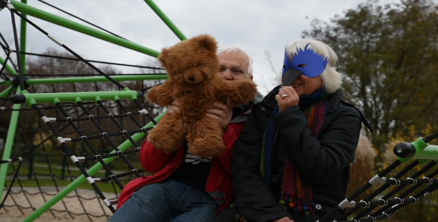

Verdrängte Realitäten erobern Raum, sprengen die Grenzen alltäglicher Wahrnehmung und machen sich auf, die Stadt zurück zu erobern.  

<ul class="bxslider">
    <li></li>
    <li></li>
    <li></li>
</ul>

Gemeinsam mit Menschen, die im öffentlichen Raum marginalisiert werden, gestalten und bespielen wir in unterschiedlichen Stadtbezirken einen Bauwagen. Verschiedene 
Lebenswelten, Geschichten und Visionen werden damit nach außen getragen. Dabei ist der Bauwagen gleichzeitig Entstehungsort und Projektionsfläche der entwickelten Arbeiten. Es entsteht ein temporär formbarer Ort, der in Zusammenarbeit mit den Gruppen zu einer lebendigen Skulptur heranwächst – bevor er sich auf die Reise macht, um weiteren Lebensrealitäten zu begegnen. 

Welche unterschiedlichen Lebenswelten existieren innerhalb einer Stadt? Wie können sie einander inspirieren? Wie können Menschen, die aus dem öffentlichen Raum verdrängt sind, diesen wieder zurück erobern? Was sind ihre Utopien? Wie können sie diese Utopien praktisch nutzbar machen? 

**Projektpräsentation November 2015 beim Symposium “Weiterdenken. Soziokultur 2030” im Kulturpavillon Hannove**r, eine Veranstaltung vom LAG Soziokultur Niedersachsen e.V., der LAG Soziokultur Thüringen e.V. sowie dem LAKS Baden-Württemberg e.V.

**Karola Reiter** (Kulturwissenschaftlerin/Stadtsoziologin), **Lutz Reiter** (Interaction Designer), **Esther Vorwerk** (Schauspielerin/Theatermacherin) 

**Dieses Projekt ist in Planung**