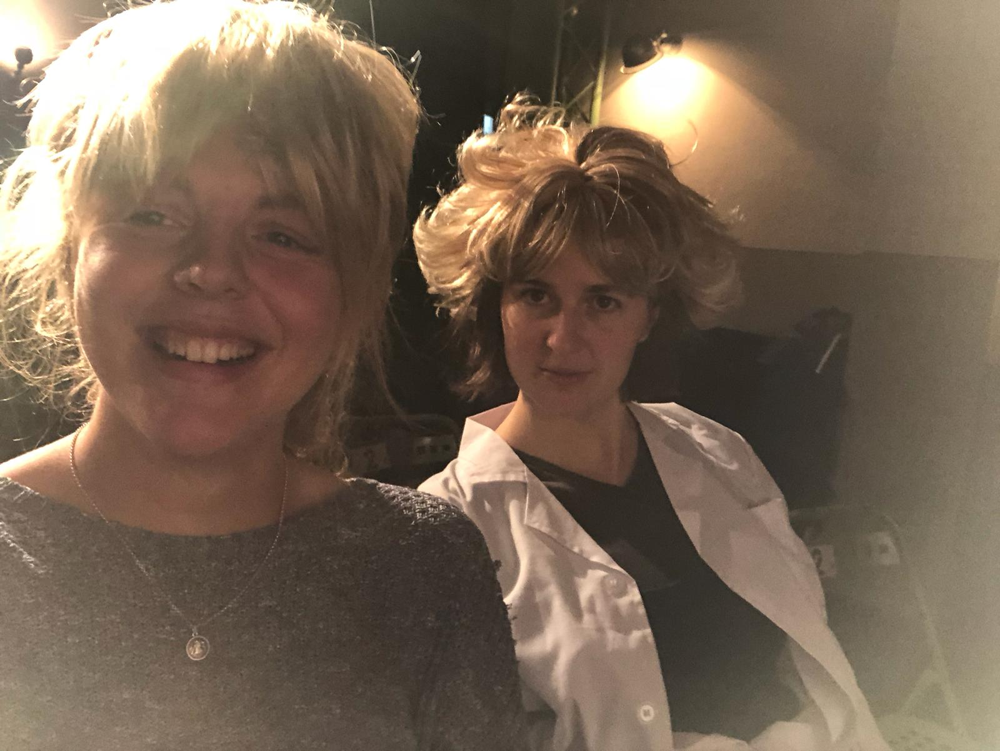

Warum sind wir hier? Wer bin ich? Wer bist du? Was bedeutet es ein Mensch zu sein? Muss eine Maschine machen wofür sie gebaut wurde? Kann ich die Welt mit gestalten? Kann man Kuchen auch zum Abendbrot essen? Ein kleines Stück Theater über die ganz großen Kinder- und Menschheitsfragen

<ul class="bxslider">
      <li></li>
            <li></li>
</ul>

„Mensch Klara, du sollst doch nicht immer alles aufheben, was du findest!“ sagt die Mama.
Aber Klara hat einen Roboter gefunden. Fünf Meter groß. Unglaublich stark und fliegen kann er auch. Unglaublich was man mit dem alles machen könnte.
Aber wofür er genau gebaut wurde, das weiß Klara nicht und er selbst erst recht nicht. Er weiß eigentlich gar nichts, findet Klara. Und deswegen beschließt sie ihm alles zu zeigen.
Die Wolken, die Bäume, die Ampel, den Kiosk, ihr Zimmer, das Armband von Mo und natürlich Ronan Keating. Die Welt eben.
Sie erklärt was ein Witz ist und den Unterschied zwischen wichtigen Regeln und nicht so wichtigen Regeln. Und sie spielen. Den ganzen Nachmittag, bis Klara ins Bett muss und der Roboter wieder in die Fabrik. Denn seine Erfinderin hat ganz andere Pläne. Erwachsene Pläne. Pläne über die Kinder sich wirklich nicht den Kopf zerbrechen müssen, sagt sie. Da kann sie Klaras Einmischung überhaupt nicht gebrauchen. Aber Klara hat sich schon eingemischt.

Stückentwicklung: 
Esther Vorwerk & Markus Wulf

Für Für Kinder ab 5 Jahren
 
**Aufführungen ab 2018 in der Limonadenfabrik des Theater Laboratorium Oldenburg**

