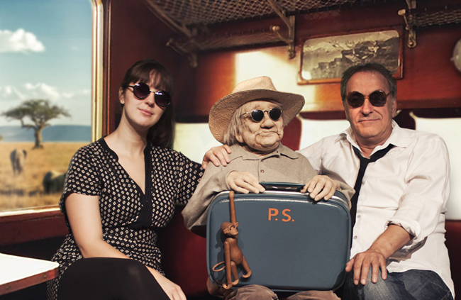

„Wenn ein kleiner Mensch, voller Angst, in einer unbekannten Stadt nach einem unbekannten Ort oder Bleibe sucht, findet er sich plötzlich machtlos wieder, ohne Wissen, wie sich gegen die Kräfte der Magie zu wehren ist. Nicht er schaut so sehr auf die Häuser, die Häuser schauen eher auf ihn.“ - Tennessee Williams

<ul class="bxslider">
    <li></li>
    <li></li>
</ul>
In einem Spannungsfeld zwischen clownesker Leichtigkeit und großer Traurigkeit zeichnen wir Pauls Geschichte nach. 

Zwischen den Kriegen geboren erlebte er eine angstvolle und traumatische Kindheit, und wollte nach dem Krieg eigentlich nur eines - vergessen. Doch die Dinge im Herzen nehmen kein Ende. Zeit seines Lebens hat Paul Vorkehrungen getroffen, die traumatischen Ereignisse des Krieges auf ewig zu verdrängen. Nie wieder wollte er sich in Gefahr bringen. Das Verdrängen wurde sein ständiger Begleiter, prägte sein Leben und auch das seiner Familie. Immer weiter, immer weiter, wollte Paul. Getrieben von Ängsten, aber auch unerfüllten Sehnsüchten und Träumen, hielt er es nirgendwo lange aus.

Anders Severin, Pauls einziges Kind, der sein Leben ganz der Arbeit im Familienbetrieb gewidmet und dem Umzüge und Veränderungen immer ein Gräuel geblieben sind. Seine Träume und Wünsche hat er, genau wie seine Familie und auch seine Tochter Marie, immer hintenangestellt. So kommt es, dass Marie ihren Vater eigentlich kaum kennt. Aufgewachsen in Oslo bei ihrer Mutter, wohnt sie mittlerweile in London. Ruhe- und rastlos reist sie durch die Welt, zieht alle paar Wochen um und kommt doch niemals an, ganz ähnlich wie ihr Großvater Paul. Ein Zufall? Zu Pauls 87. Geburtstag kommt Marie extra mit dem Zug aus London angereist. Fliegen will sie nicht, wie im Übrigen ihre ganze Familie. Noch ein Zufall?

Gemeinsam versuchen Severin und Marie, den Anforderungen des Alltags mit Paul gerecht zu werden und entdecken dabei sowohl sich selbst als auch die Welt des Anderen neu. Marie erfährt erstmals etwas über die Geschichte er Familie. Severin lernt den Vater von einer ganz anderen Seite kennen. Denn mit der Demenz und dem Vergessen des Erlebten entsteht plötzlich so etwas wie eine Leichtigkeit in Pauls Leben. Eine Leichtigkeit, die auch Severin und Marie spüren und die auch sie zum Nachdenken anregt. Und aus dem Nichts, von Paul längst verdrängt, tauchen alte Hoffnungen und Träume wieder auf. Längst verloren geglaubte Erinnerungen an seine Kindheit in Königsberg und sein lang gehegter Lebenstraum, einmal zum Kap der guten Hoffnung zu reisen. Aber er wollte ja nie fliegen... Kann man da denn gar nichts machen?
 
 
**Aufführungen ab 29. September 2016 im Theater Laboratorium Oldenburg**,

**Presse**
  
* Dies ist das traurigste und komischste Stück der Welt. Es spielt in einer Zeit, in der eigentlich keiner Zeit hat. Also heute. Und es handelt von einem Problem, das alle kennen, aber viele immer noch tabuisieren: Es geht um Demenz.

* Ein zauberhafter Abend. Die etwa 90 pausenlosen Minuten vergehen wie im Flug. Nie will man auf die Uhr schauen. Wann hat man so etwas zuletzt in einem Theater erlebt?

(Nord West Zeitung, 01.10.2016, Reinhard Tschapke)
http://www.nwzonline.de/kultur/wenn-opa-alles-neu-sieht_a_31,1,1620093044.html

**Weitere Links**  
http://www.theater-laboratorium.org/
