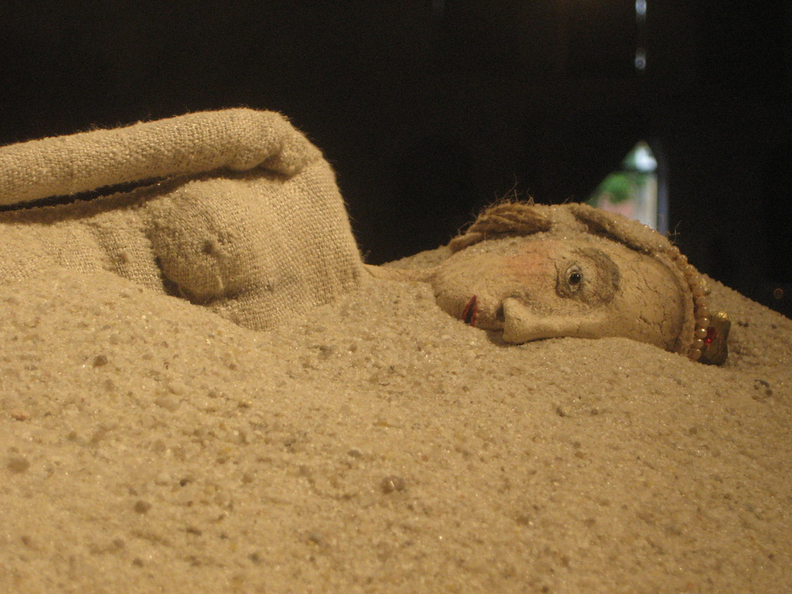
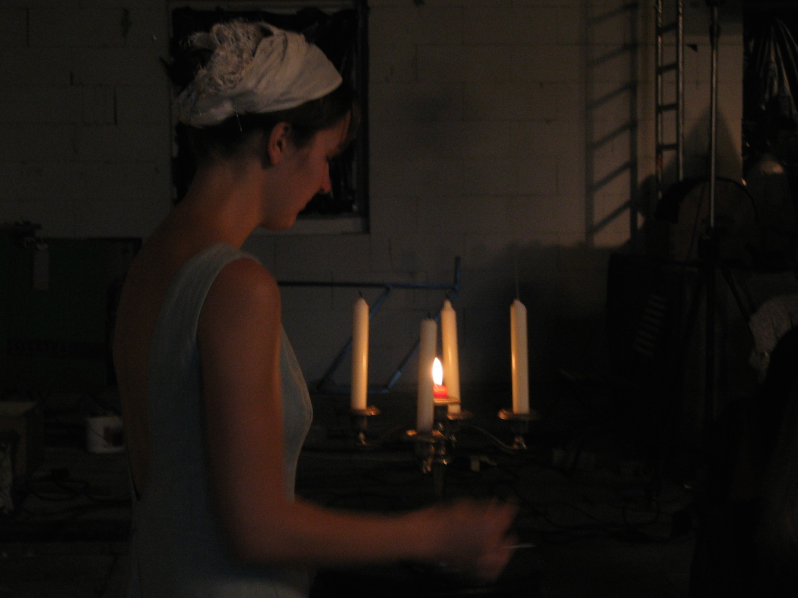
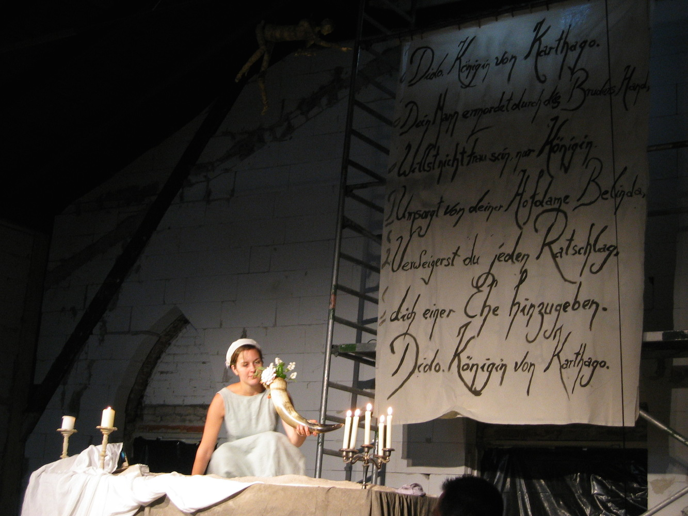
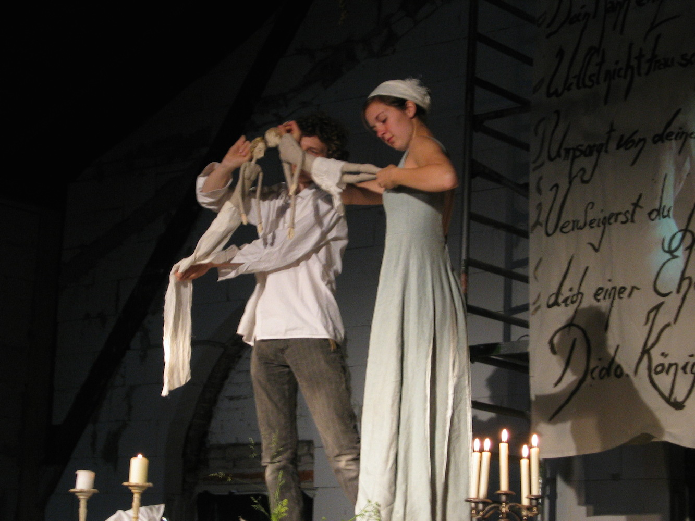
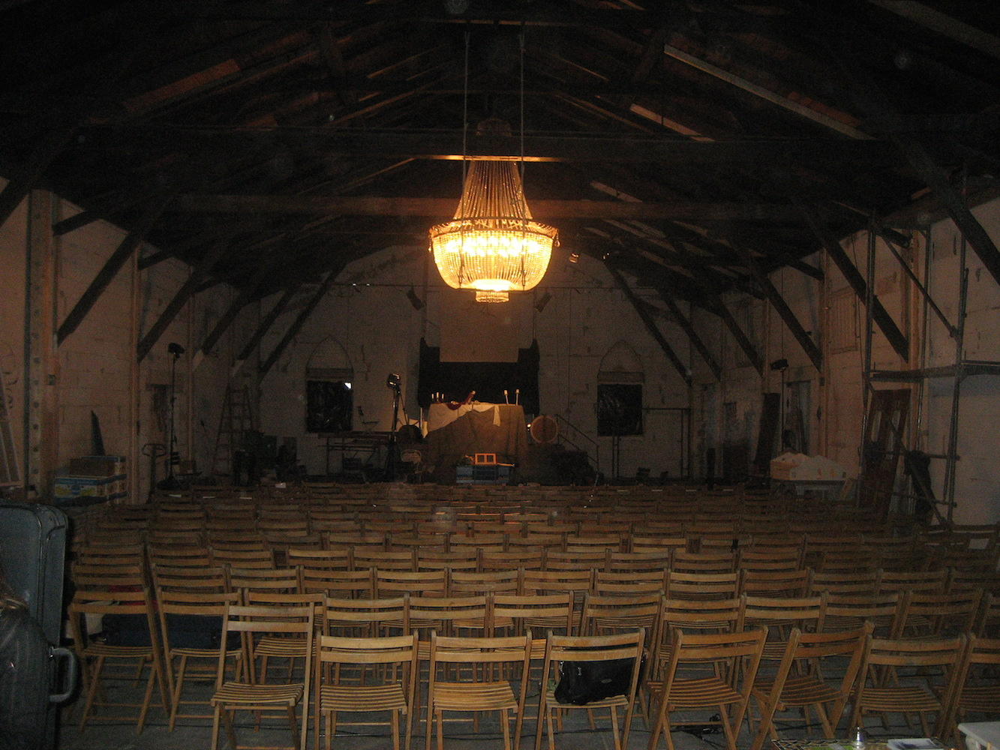

Wie verletzlich muss man werden um lieben zu können? Wie verletzlich darf man werden in kriegerischen Zeiten? Dido and Aeneas. Die Königin und der Krieger. Eine große und tragische Liebesgeschichte vor dem Hintergrund des trojanischen Krieges. Ein barocker Abend mit Kerzenschein, Instrumenten, Stimmen und Figuren.

<ul class="bxslider">
    <li></li>
    <li></li>
    <li></li>
    <li></li>
    <li></li>
    <li></li>
    <li></li>
</ul>

**Im Mai 2007 Theater Laboratorium, Oldenburg** eine Koproduktion mit dem Staatstheater Oldenburg

Bühne/Spiel/Puppen: **Esther Vorwerk** und **Markus Wulf**, Musik: **Ute Biniaß**,**Toshihiko Matsui**, **Constanze Brüning**, **Sabine Gebauer**, **Sharon Starkmann**, **Ulrike Folch**, **Kerstin Kramer**, **Andre Janacek** und **Armin Skrzipczy**, Musikalische Leitung: **Thomas Bönisch**

**Presse**

* <http://www.nwzonline.de/oldenburg/kultur/gliederpuppen-werden-zu-helden-auf-theaterbuehne_a_5,1,949898908.html>

* <http://www.nwzonline.de/wesermarsch/kultur/hoelzerne-operndarsteller-reissen-publikum-mit_a_5,1,795951327.html>

* <http://www.nwzonline.de/oldenburg/kultur/barock-oper-auf-der-baustelle_a_5,1,949495958.html>
