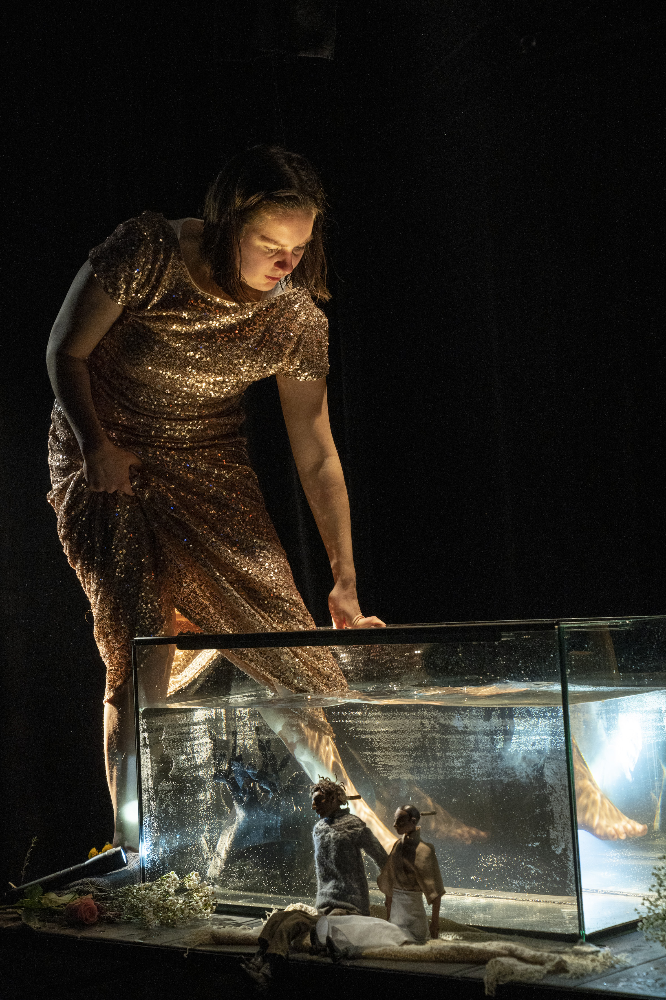
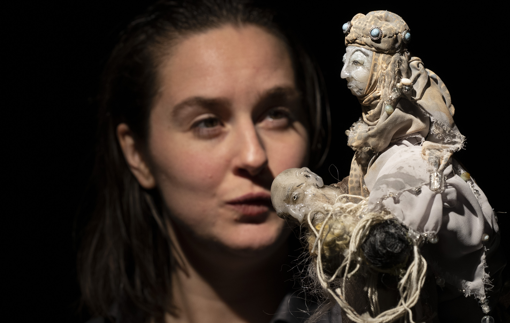
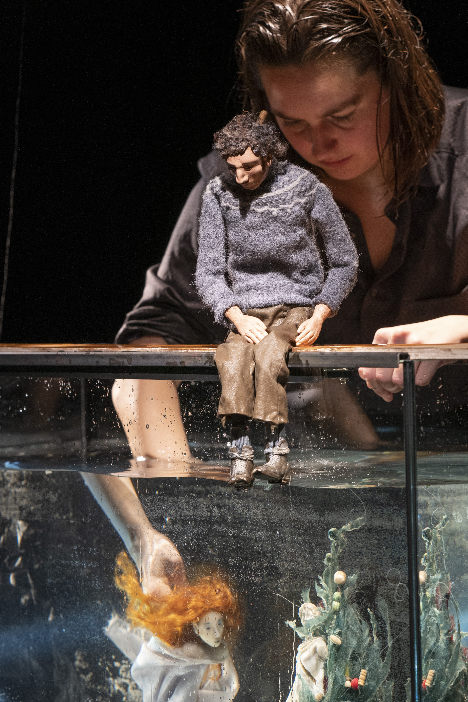
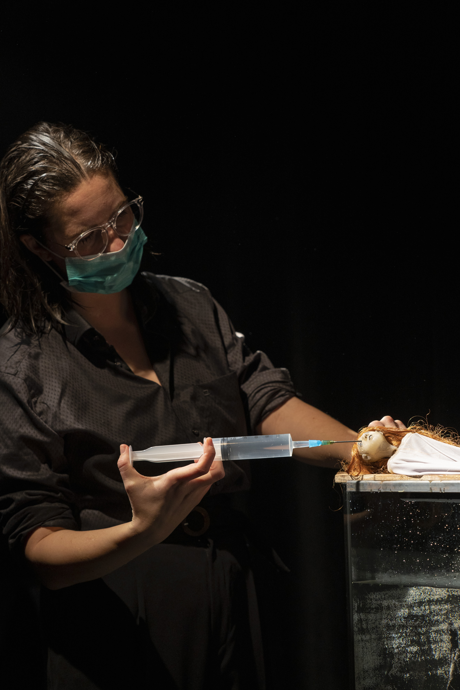
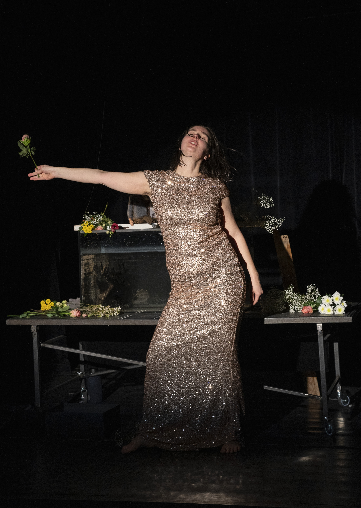

If I cannot change my situation I will change myself.
In this act of magical transformation I recognize myself again.
I am groundless and boundless movement. I am a furious flow.
I am one with the darkness and the wet.
And I am enraged.
Here at last is the chaos I held at bay. Here at last is my strength.
I am not the water
I am the wave, and rage is the force that moves me.
 
 Susan Stryker

<ul class="bxslider">
      <li></li>
            <li></li>
                 <li></li>
                      <li></li>
                           <li></li>
</ul>

Zweimal sägte man ihr den Kopf ab, einmal den rechten Arm. Man sprengte sie von ihrem Sockel und besprühte sie immer wieder mit Farbe. Die kleine Meerjungfrau, die Statue an der Hafeneinfahrt in Kopenhagen provoziert bis heute, genau wie die romantische Märchenfigur auf der sie basiert. Eine weibliche Hauptfigur, die begehrt und in vollem Bewusstsein der Konsequenzen, alles in Frage stellt; ihre Umwelt, ihre Identität, ihren Körper, die ihr  vorgeschriebenen Geschlechterrollen und heteronormativen Beziehungsbilder.

Eine Performance mit Figuren, unter und über Wasser. Mit Originaltexten, Popmusik, Walgesängen, Pailletten, Lippenstift und einem Dolch.

Idee & Konzept: Esther Vorwerk, Markus Wulf
Regie: Markus Wulf
Spiel: Esther Vorwerk
Technik & Assistenz: Wiebke Gärtner
Dramaturgische Mitarbeit: Lou Kordts
Figuren: Markus Wulf
Bühne: Leon Dutz, Beatrice Bader
Fotos: Stephan Walzl
Für Jugendliche ab 13 Jahren und Erwachsene
 

**Aufführungen ab 2019 in der Limonadenfabrik des Theater Laboratorium Oldenburg**

