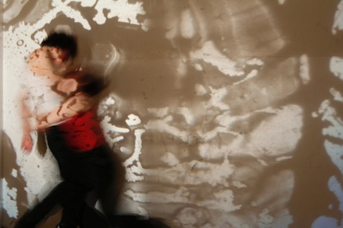
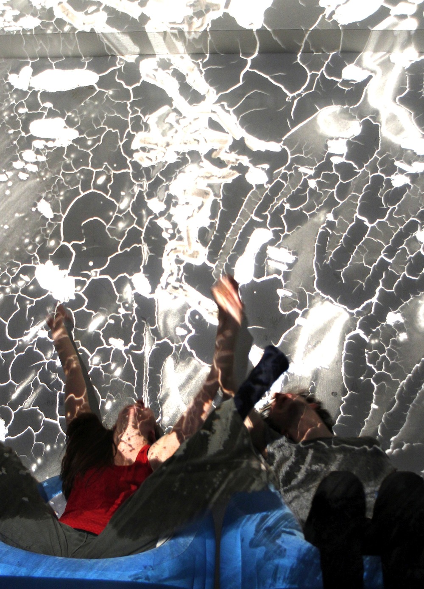

Eine Performance zum asylpolitischen Alltag in Deutschland mit Papier, Zeichnungen und Musik im Ballhaus Ost Berlin.

<ul class="bxslider">
    <li></li>
    <li></li>
</ul>

Die SpielerInnen hinterfragen ihre eigenen Verhaltensweisen. Welche Vorstellungen haben sie vom asylpolitsichen Alltag in Deutschland? Welche rassistischen Einstellungen haben sie verinnerlicht? Wie werden sie aktiv und was nehmen sie als gegeben hin? Was bedeutet ihr Handeln oder Nichthandeln? Sie konfrontieren sich und das Publikum mit den Realitäten und machen öffentlich, was diese Auseinandersetzung in ihnen auslöst. Die Flüchtlinge sehen wir auf der Leinwand. Sie sind abwesend, draußen, wie sie auch in unserem Alltag und dem gesellschaftlichen Bewusstsein abwesend sind. Es wird mit Originaldokumenten, Interviews, Fotos und Videos gearbeitet. Der Maler projiziert das Entstehen seiner Zeichnungen mit einem Polylux auf die Bühne oder er zeichnet direkt auf das Papier. Er ist Teil der Auseinandersetzung und bebildert seine Vorstellungen von der Realität mit schwarz/weißen Skizzen.

<iframe src="https://www.youtube.com/embed/cq1np410P6s" frameborder="0" allowfullscreen></iframe>

<iframe src="https://www.youtube.com/embed/Zb0Ky9WSW6Q" frameborder="0" allowfullscreen></iframe>

**Premiere März 2014, Ballhaus Ost**

Konzept, Stückfassung: **Paula Dombrowski** und **Esther Vorwerk**, Regie: **Paula Dombrowski**, Spieler: **Esther Vorwerk** und **Johannes Frick**, Musik: **Sebastian Deufel**, Livezeichnungen: **Péter Máté**, Regieassistenz: **Stefanie Schwanz**, Produktion:  **Annja Hofft**

Koproduktion mit dem Ballhaus Ost, gefördert durch die Körber-Stiftung Hamburg und die Rosa-Luxemburg-Stiftung, mit Unterstützung von startnext

**mehr Video- und Bildmaterial**  
<http://www.annja-hofft.de/draussen.html>  

**Crowdfunding**  
<https://www.startnext.de/annja-hofft-draussen>  

**Facebook**  
<https://www.facebook.com/annjahofft?fref=ts>

**Presse**

* Freitag
<https://www.freitag.de/autoren/jamal-tuschick/sturm-auf-die-speckseite>

* BpB
<http://www.bpb.de/partner/akquisos/186064/beispiele-erfolgreicher-crowdfunding-kampagnen>
