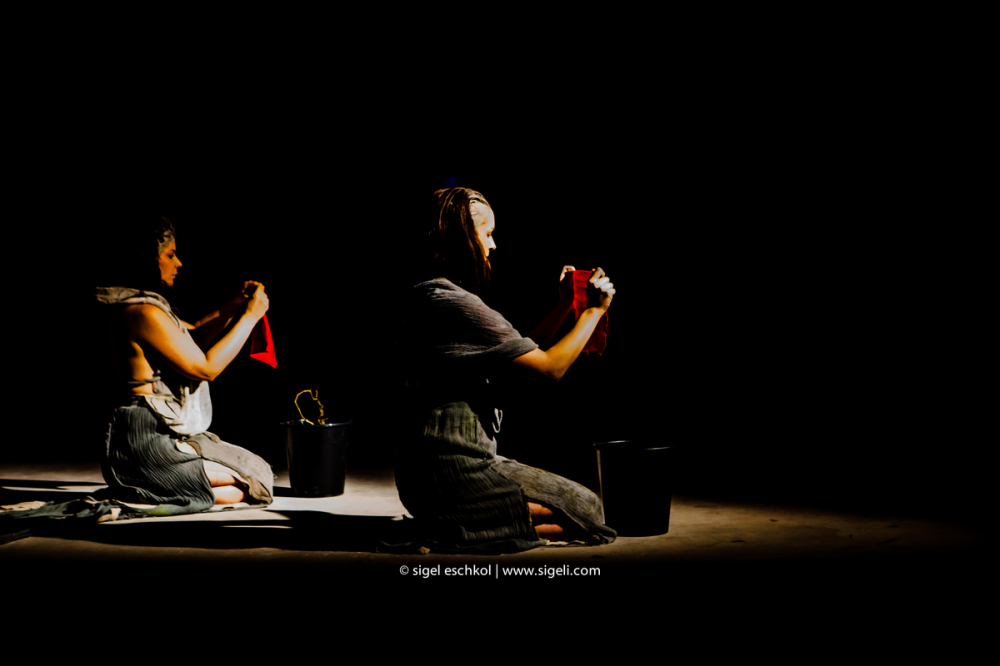
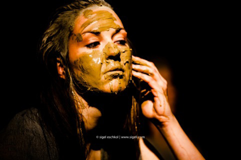
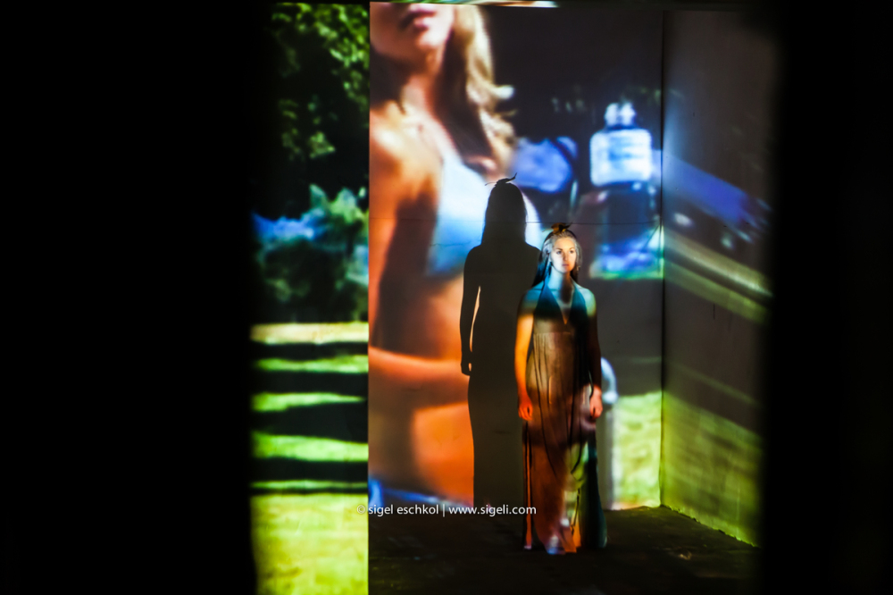
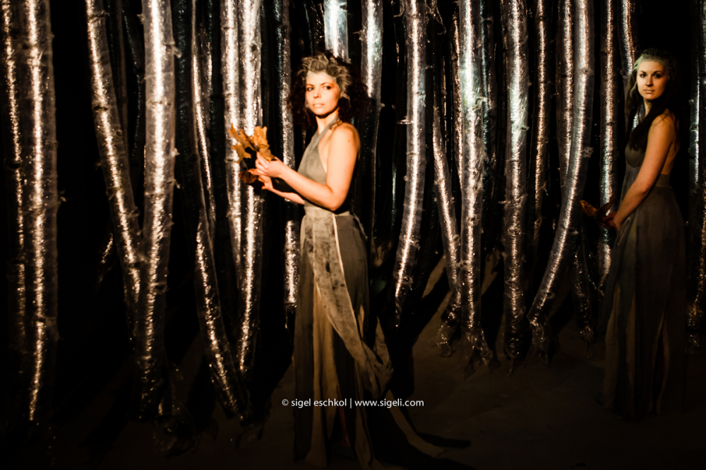
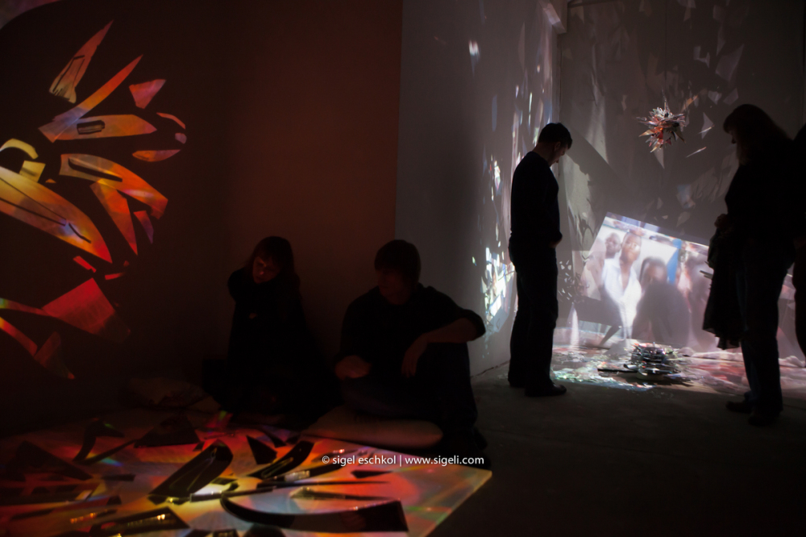
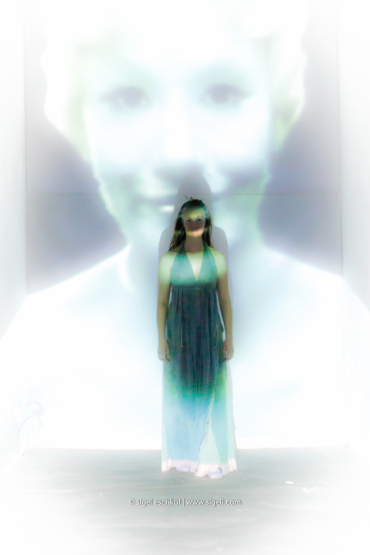
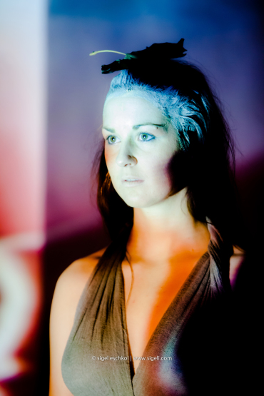

Die Show »Tea V – Tee V« ist eine Einladung, unser gespaltenes Leben wieder in Einklang zu bringen. Ein Gleichgewicht zu schaffen zwischen den TV-Illusionen und der Vielfalt und Ruhe, die sich einstellt, wenn man sich selbst akzeptiert. Der flache Bildschirm wird in eine dynamische, interaktive »3D-Welt« des menschlichen Seins transformiert.

<ul class="bxslider">
    <li></li>
    <li></li>
    <li></li>
    <li></li>
    <li></li>
    <li></li>
    <li></li>
</ul>

**Trailer**

<iframe src="https://player.vimeo.com/video/120912193"frameborder="0" webkitallowfullscreen mozallowfullscreen allowfullscreen></iframe>

**Erste Performances: Dezember 2014 Pateau Galerie Berlin**,  
Veranstaltet von der Dezentralen Kulturarbeit und der Plateau Galerie im Rahmen des Crosskultur-Festivals Berlin Tempelhof.

Konzept und Regie: **Roi Weinstein**, Visuelles Design: **Zeljko Spehar** und **Marie Klinke**, Sound Design: **Stefan Roeslmaier**;  Installationskünstlerin: **Anne Amelang** und **Avidal Yomdin**, Kostüm Design: **Sarah Kelley**, Performerinnen: **Esther Vorwerk**, Licht Design: **Roi Weinstein** und **Lee Efrat**, Produktion: **Esther Vorwerk**

**mehr Bilder**  
<http://blog.sigeli.com/2014/12/18/the-tea-v-show-a-multidisciplinary-interactive-performance-exhibition/>
