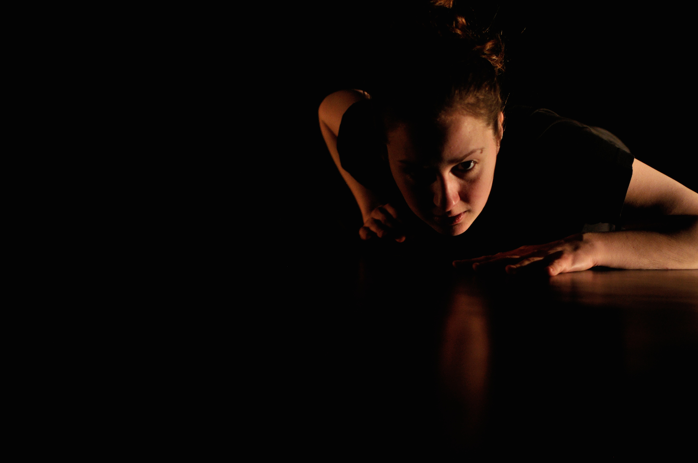
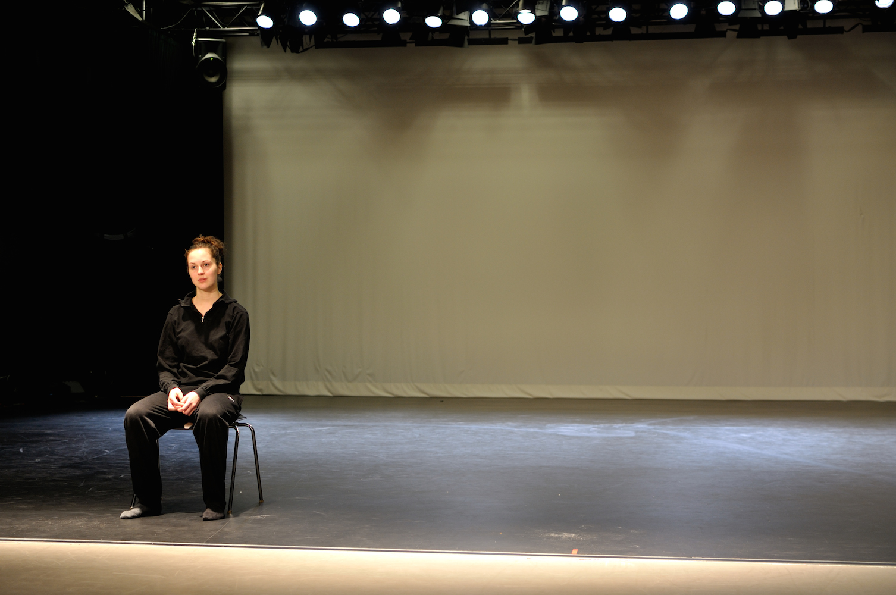
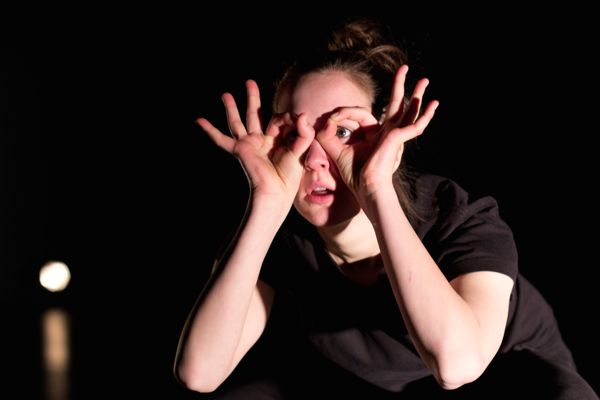
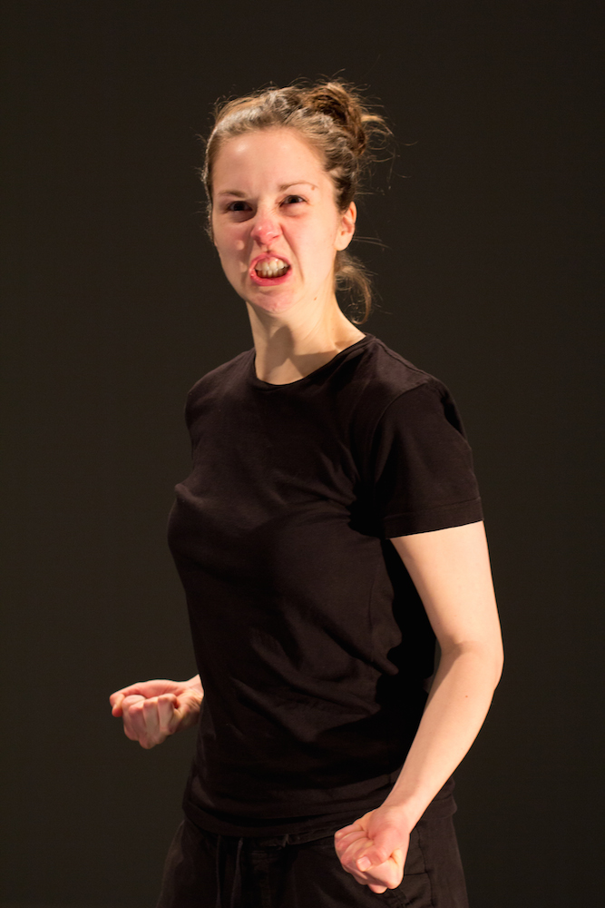
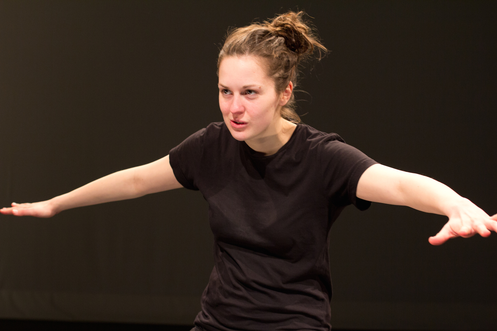
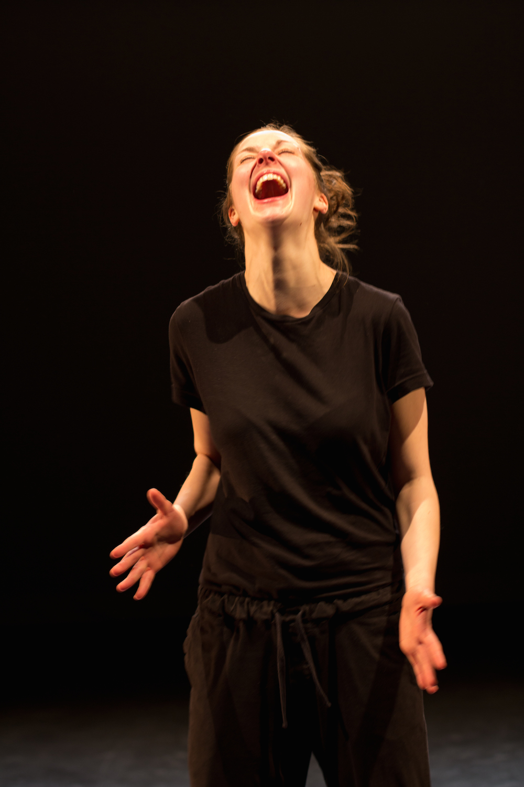
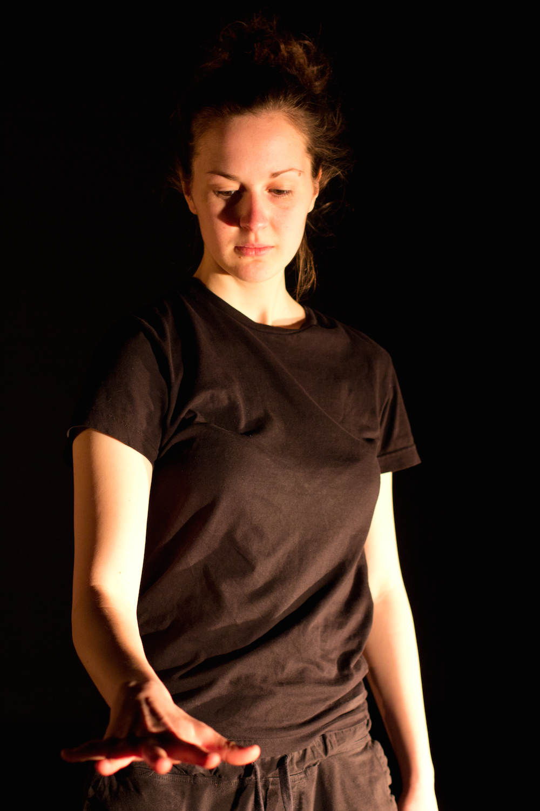

Sein Sprecher ist leer. Der ist nur noch ein Körper. Der zuckt wie in Flammen. Das ist der Preis für die Entfremdung, die er sich geleistet hat. Weil ja jedes Sprechen im Grunde genommen eine Entfremdung nach sich zieht.(Julia Jost)

<ul class="bxslider">
    <li></li>
    <li></li>
    <li></li>
    <li></li>
    <li></li>
    <li></li>
    <li></li>
</ul>

In unserer Arbeit suchen wir nach Schnittstellen und einer Verständigung zwischen Sprechtheater und Tanz, Bewegung und Text.

<iframe src="https://www.youtube.com/embed/6MTMIqJq8-0" frameborder="0" allowfullscreen></iframe>

**Premiere März 2012, HfMT Köln**

Schauspiel/Tanz/Sprecherin: **Esther Vorwerk**, Choreografie/Regie: **Valérie Kommer**, Text/Regie: **Juliar Jost**

