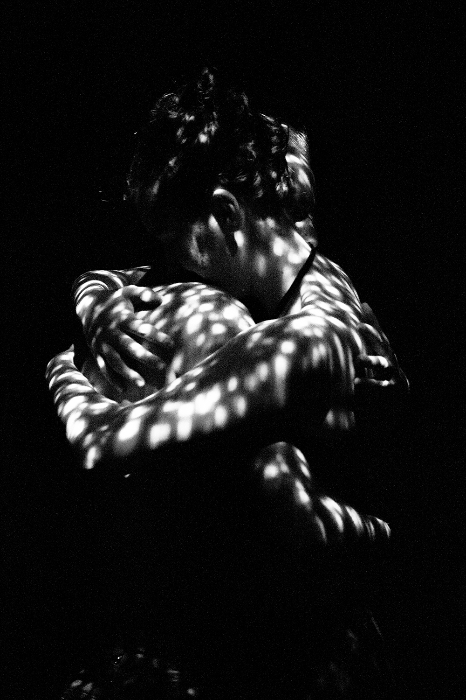
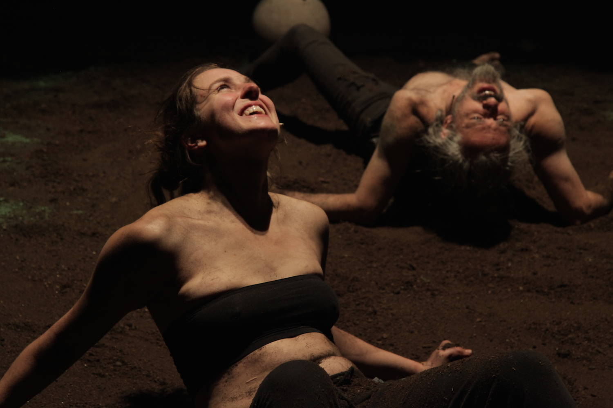

Woraus bestehen unsere Schatten? 
Wie können wir ein Stadium des Bewusstseins erlangen, in dem wir die Ketten unserer Vergangenheit lösen können?
Wer sind wir ohne unsere Erinnerungen?
Ein Ritual fängt da an, wo wir keine befriedigenden Antworten finden.

<ul class="bxslider">
    <li></li>
    <li></li>
    <li></li>
    <li></li>
    <li></li>
    <li></li>
    <li></li>
</ul>

Der israelische Regisseur und Schauspieler Itay Ganot und die deutsche Schauspielerin Esther Vorwerk, beide dritte Generation nach dem zweiten Weltkrieg, suchen in ihren persönlichen Biographien einen kollektiven Schatten, der immer noch vorhanden ist. Gemeinsam entwickeln sie ein Ritual um den Kreislauf der unendlichen menschlichen Konflikte in eine wahre Begegnung zu verwandeln. 

**Trailer**
<iframe src="https://www.youtube.com/embed/yZ39xEg5kUo" frameborder="0" allowfullscreen></iframe>

**Auführungen ab 02. Oktober 2015 im Haimathafen Neukölln**,
eine Koproduktion mit der Friedrich Ebert Stiftung Berlin

Regie, Schauspiel: **Itay Ganot**, Produktion, Stückentwicklung, Schauspiel: **Esther Vorwerk**, Co-Regie, Training: **Dimitris Tsiamis**, Musikalische Leitung, Sound Design: **Amir Zoref**, Produzentin:** Naama Muflag**, Co-Produzent: **Dan Yoel**, Set & Visual Design: **Sifis Lykakis**, Dramaturgische Beratung: **Verena Harzer**, Photographie: **Eyal Dinar**

**Presse**
  
* "Jetzt befindet sich ein Kreis auf dem Boden, ein Beamer leuchtet die Szene mit grellbunten Strahlen aus. Dazwischen stehen sich Esther Vorwerk und Itay Ganot gegenüber, sie tanzen, reden, erzählen ihre Geschichte oder rezitieren Kinderlieder auf Deutsch und auf Hebräisch. Eine "rituelle Begegnung" haben sie ihre Arbeit am Ende genannt, der Titel lautet "White Shadow", weißer Schatten. Um das Unsichtbare, Unerklärliche zu beschreiben, das die beiden zusammengebracht hat. Es sind viele junge Israelis und Deutsche gekommen, das Publikum sieht eine Off-Theaterproduktion, gemacht mit wenig Geld und großem Einsatz.
(Süddeutsche Zeitung, 07.10.2015, Verena Mayer)
http://www.sueddeutsche.de/panorama/berlin-tanzen-reden-schreien-1.2679994?reduced=true  

* "Hitler war genau so. Genau wie in diesem Film." Es ist ein Schlüsselmoment, in dem für Esther wohl der innere Konflikt real wird. Sie stellt sich grundsätzliche Fragen, die sie auch ins Publikum feuert: Wie hat es sich angefühlt, Hitlers Haut zu berühren? Wen hast du getötet? Und dann: Wie kann ich jemals lieben? Das berührt.
(Berliner Morgenpost vom 19.10.2015, Elisa von Hof)
http://www.morgenpost.de/kultur/berlin-kultur/article206307735/White-Shadow-Die-Schatten-der-anderen.html

**Weitere Links**  
http://schwarzkopf-stiftung.de/events/white-shadow/

**FILM Dokumentation zum Probenprozess**  
http://www.ronittayar.com/projects/documentary/