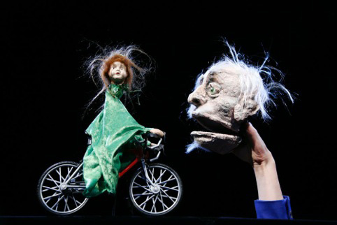
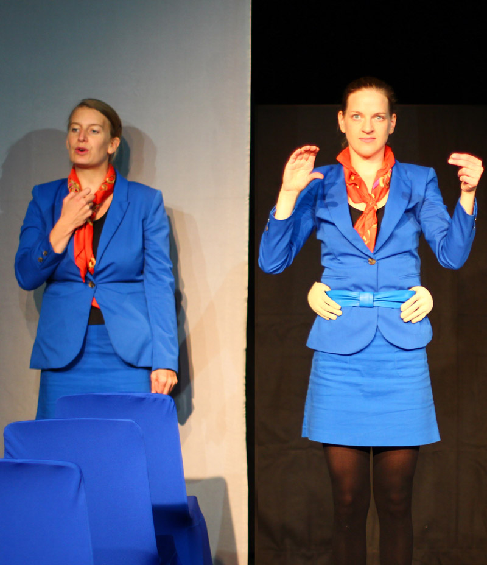
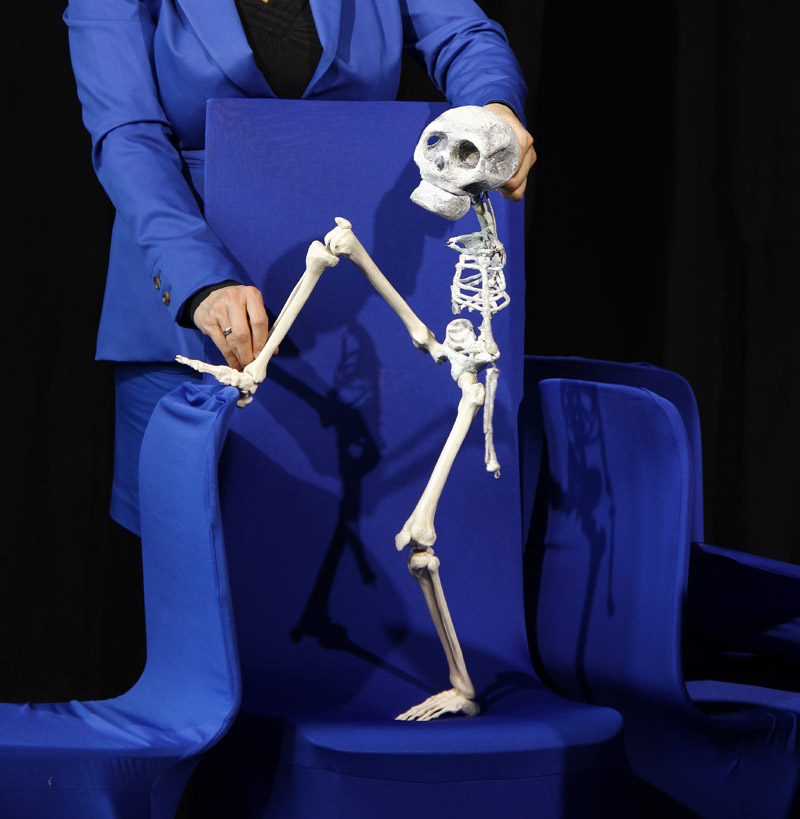

75 Minuten, 30 Figuren, 2 Spielerinnen - Ein Flug über den Atlantik, durch die absurden Höhen und Tiefen des menschlichen Daseins. Und fertig.

<ul class="bxslider">
    <li></li>
    <li></li>
    <li></li>
</ul>

Auf der Erde sitzen zwei im Gras. Sie angeln und träumen von Brasilien. Über ihnen am Himmel fliegt gerade ein Flugzeug nach Rio de Janeiro. Die beiden Freunde versuchen erfolglos, etwas an den Haken zu bekommen, zur selben Zeit werden an Bord der Charms Airlines Geschichten serviert, auf Tabletts; Hauptgericht: natürlich Fisch.
So trifft Adam auf Eva, Eva trifft Leonardo, der Gelehrte trifft ins Schwarze und wieder einmal treffen sich die füreinander Bestimmten nicht. Und während die beiden Herren nichts von den Geschehnissen an Bord wissen, manifestieren sich ihre Erinnerungen und Träume dort oben zwischen Tomatensaft und Turbulenzen.

**Premiere Juli 2012, La Strada Graz**

Spiel/Konzept: **Ulrike Langenbein** und **Veronika Thieme**, Regie: **Pierre Schäfer**, Regieassistenz: **Esther Vorwerk**, Ausstattung: **Ulrike Langenbein**

eine Kooperation mit La Strada Graz, gefördert vom Amt für Kultur und Bildung, Bezirksamt Pankow von Berlin.

**Website**  
<http://www.handmaids-berlin.de>
